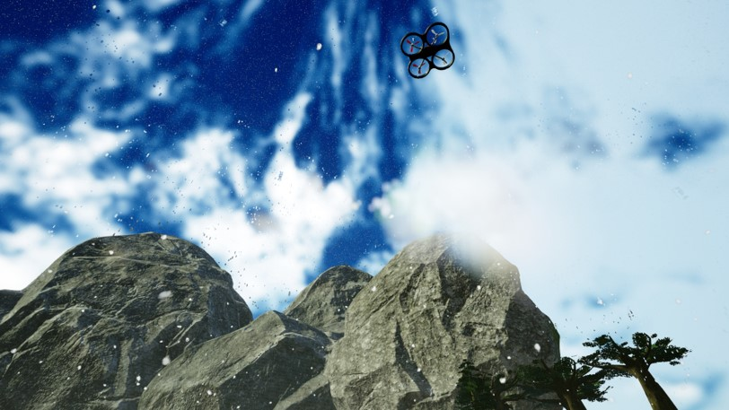
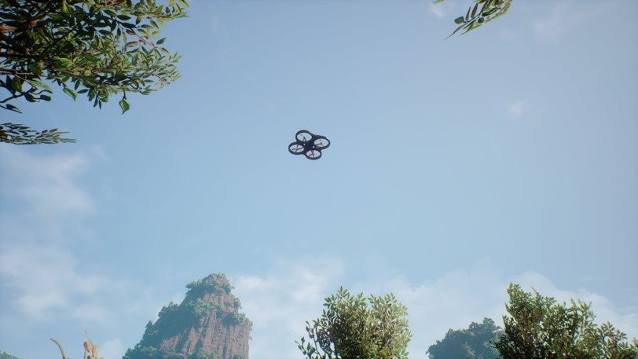
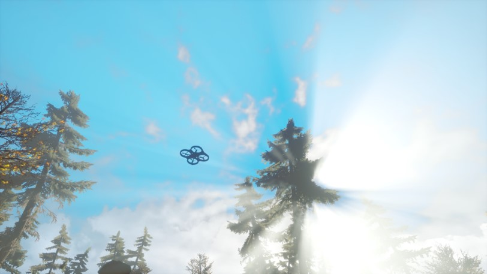
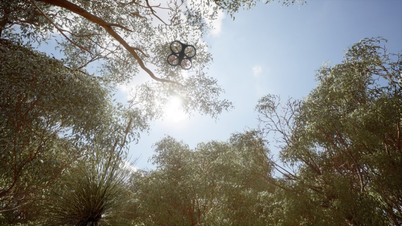
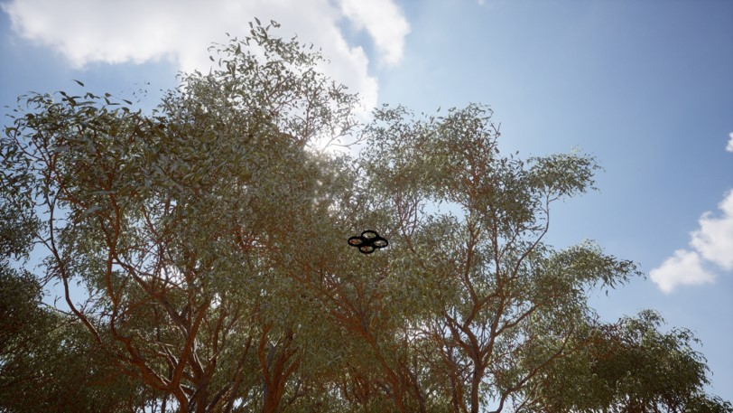
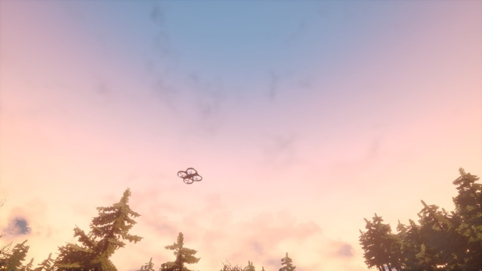
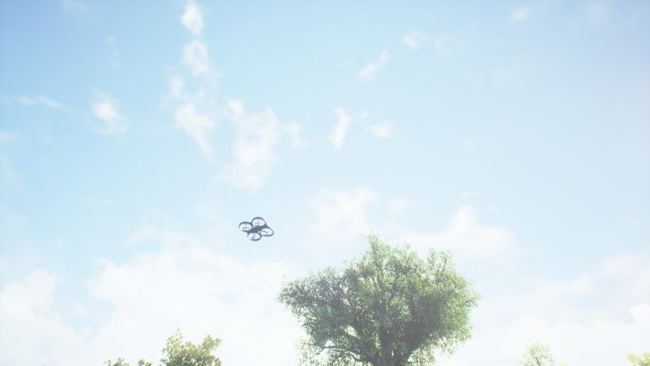

# HymDrone Quadrotor UAV Dataset

## 1. Dataset Overview

HymDrone is a quadrotor UAV dataset constructed based on practical engineering applications.
The dataset is generated using the AirSim simulation platform and is designed for computer vision tasks such as UAV object detection and object tracking.
It features a large scale, diverse scenes, and challenging environmental conditions.

The dataset systematically organizes high-quality UAV image data collected under different scenes and weather conditions, along with corresponding annotation files.
It is suitable for research and educational purposes in UAV visual perception.

## 2. Dataset Generation

The dataset is generated using the AirSim simulation platform.
By constructing various complex environments and flight conditions, HymDrone simulates UAV scenarios encountered in real-world engineering applications.

In total, the dataset contains 55 video sequences, comprising 59,138 high-quality images.
All images are captured at a high-definition resolution of 1920 × 1080 pixels, and precise bounding box annotations are provided for each UAV target in every image.

## 3. Scene and Weather Settings

### (a) Scene Types (9 Categories)

The dataset covers the following nine representative scene types:
- Park
- 
- Nighttime
- 
- Hilly areas with trees
- 
- Terrain with trees
- 
- Beach
- 
- Jungle
- 
- Mountains
- 
- Highways
- 
- Sunset
- 

These scenes feature complex background structures and varying levels of occlusion, effectively increasing the diversity and difficulty of the dataset.

### (b) Weather Conditions (5 Categories)

For each scene, the dataset further introduces five different weather conditions:

- Sunny
- 
- Fog
- 
- Haze
- 
- Falling leaves
- 
- Heavy rain / snow
- 

The combination of diverse scenes and weather conditions significantly enhances the generalization capability of the dataset.

## 4. Applications

The HymDrone dataset can be used for the following research tasks:

- UAV object detection
- UAV object tracking
- UAV visual perception in complex environments
- Generalization analysis from simulation to real-world scenarios

## 5. License and Usage

This dataset is released for academic research and educational use only.
Commercial use is strictly prohibited.
If this dataset is used in papers, reports, or projects, please acknowledge the dataset source.
