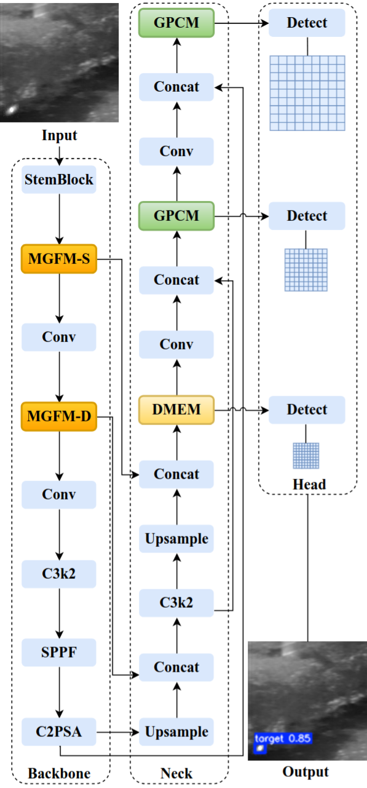
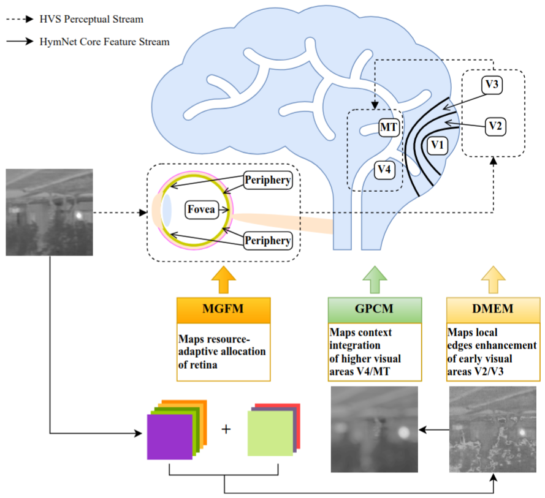
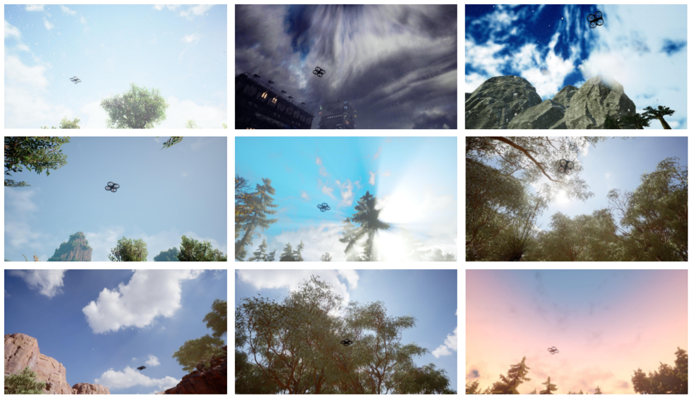
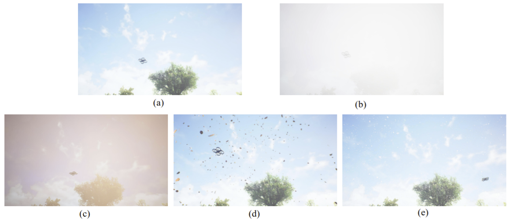
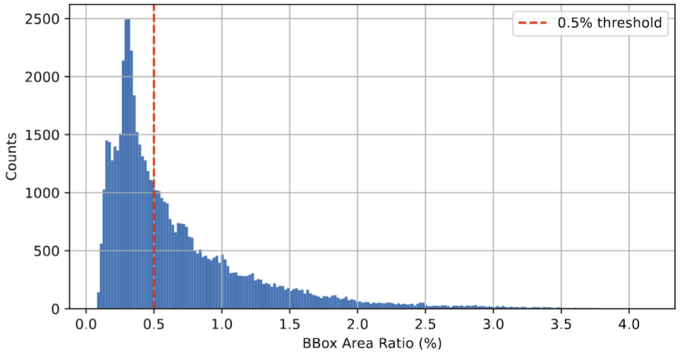
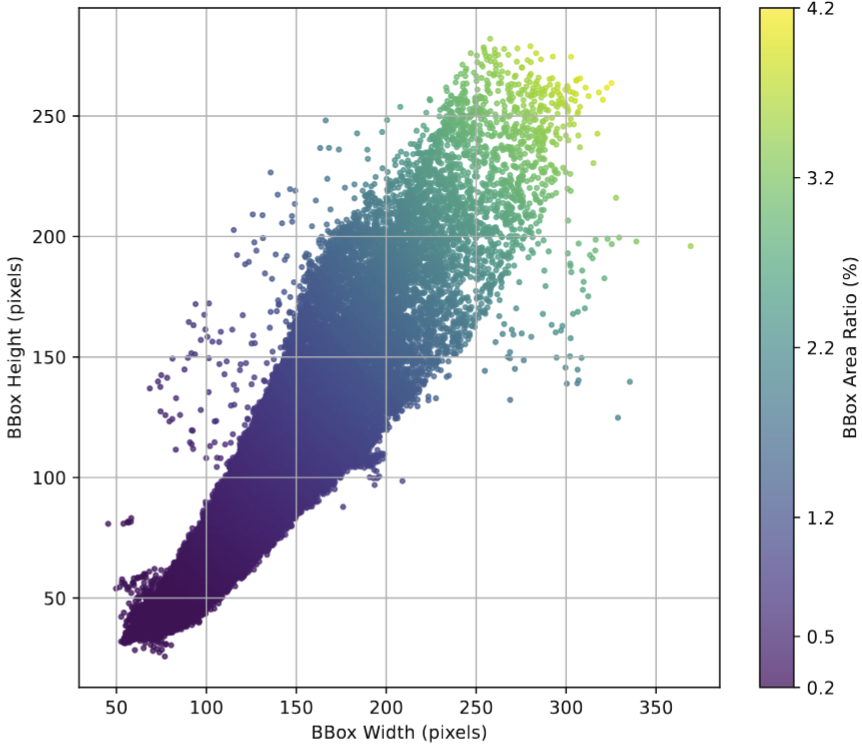

# HymNet: A Hybrid Multi-Granularity Perception Network for Small Target Detection
**Authors:** Dongjie Zhou, Chang Liu, Jiajun Zhu, Wenrui Li (Member, IEEE), Yong Wang, Xiaopeng Fan (Senior Member, IEEE)

---

- [2026/02] HymNet training and inference code has been released.
- [2026/01] A preliminary version of the HymDrone dataset has been released.

---

## Overview
This repository provides the official implementation of **HymNet**, a human visual system (HVS)-inspired framework for small target detection. HymNet emulates retinal resource allocation (via MGFM), contour sharpening (via DMEM), and contextual integration (via GPCM) to achieve robust cross-modal and cross-viewpoint detection.

<p align="center">
  
  &nbsp;&nbsp;&nbsp;&nbsp;&nbsp;&nbsp;&nbsp;&nbsp;
  
</p>   

**Figure**: Overview of HymNet and its dual-stream functional mapping with the human visual system (HVS).

---

## Environment Setup
```bash
# 1. Clone the repository
git clone https://github.com/tiger413/HymNet.git
cd HymNet

# 2. Create a virtual environment
conda create -n hymnet python=3.9

# 3. Activate the virtual environment
conda activate hymnet

# 4. Install dependencies
pip install -r requirements.txt

# 5. Install the project in editable/development mode
pip install -e .
```

---

## HymDrone Quadrotor UAV Dataset

### Introduction

**HymDrone** comprises 59,138 high-resolution images across 55 sequences, encompassing 9 distinct scene types: park, nighttime, hilly areas with trees, open terrain with sparse trees, beach, jungle, mountains, highways, and sunset — as well as 5 diverse weather conditions: sunny (a), fog (b), haze (c), falling leaves (d), and heavy snow or rain (e). Illumination conditions vary from dawn to dusk. All images have a resolution of 1920×1080 pixels, and precise bounding box annotations are provided for each UAV target.

<p align="center">
  
</p> 

**Figure**: Nine different scene types of HymDrone.

<p align="center">
  
</p>  

**Figure**: Five different weather conditions of HymDrone.

With respect to target scale, statistical analysis shows that **more than 52%** of UAV targets occupy **less than 0.5%** of the image area, and the majority of bounding boxes are small in both width and height.

<p align="center">
  
  &nbsp;&nbsp;&nbsp;&nbsp;
  
</p>  

**Figure**: Analysis of bounding box statistics in HymDrone: histogram of area ratios (bounding box area / image area) and scatter plot of width vs. height, with points colored by area ratio.

### Download
Download HymDrone dataset from Baidu Netdisk and place it in the repository root directory:

- Baidu Netdisk: https://pan.baidu.com/s/19RUSTpwWkdMI4_8NLSjZAQ?pwd=duas

---

## Training

Run training:

```bash
python src/train.py
```
---

## Inference (Testing)

Run inference:

```bash
python src/test.py
```

------

## Acknowledgements

This project builds upon and is inspired by the following open-source projects and resources:

- Ultralytics: https://github.com/ultralytics/ultralytics
- LEGNet: https://github.com/AeroVILab-AHU/LEGNet
- FCM: https://github.com/galaxy-oss/FCM

We thank the authors for their excellent work.

------

## Contact

If you have any questions, please contact dongjiezhou@stu.hit.edu.cn
